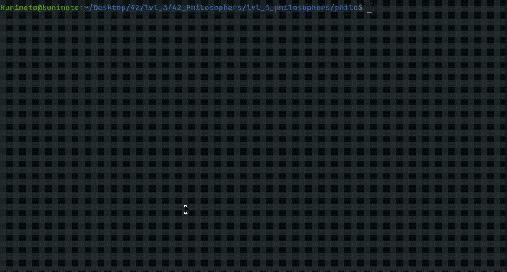

# Philosophers (42Porto - 42Cursus)  

## Description  

[Dining philosophers problem](https://en.wikipedia.org/wiki/Dining_philosophers_problem) in C; A version with threads (/philo) and another with processes (/philo_bonus). Introduction to parallel programming.

## Grade: 100/100  

### Installing and running the project  

1- Clone this repository
	
	git clone https://github.com/Kuninoto/42_Philosophers philosophers
2- Navigate to the version of the project you wish to run

	cd philosophers/<philo|philo_bonus>
3- Compile and clean the object files that you won't need anymore

	make && make clean
3- Run your new dining philosopher simulation program!

	./philo <nbr_of_philos> <time_to_die> <time_to_eat> <time_to_sleep> [nbr_of_times_each_philo_must_eat]

#### Side note/warning for 42 students  
I did the bonus part but I did not deliver it, it isn't in its final form and neither I tested it
sufficiently to guarantee that it's fully working.  

#### Makefile available targets  
`make` or `make all` - compiles `philo` or `philo_bonus` (depending on the version of the project you're running)   
`make clean` - wipes all object files   
`make fclean` - deletes executable and all object files   
`make re` - `fclean` + `all`  

### Useful links  
General thread understanding:  
[Introduction to threads (pthreads) | C programming](https://www.youtube.com/watch?v=ldJ8WGZVXZk)  
[How to create and join threads in C (pthreads)](https://www.youtube.com/watch?v=uA8X5zNOGw8&list=PL9IEJIKnBJjFZxuqyJ9JqVYmuFZHr7CFM)  
[Short introduction to threads (pthreads)](https://www.youtube.com/watch?v=d9s_d28yJq0&list=PLfqABt5AS4FmuQf70psXrsMLEDQXNkLq2)  
[Multithreading in C](https://www.geeksforgeeks.org/multithreading-c-2/)  
[What are race conditions](https://www.youtube.com/watch?v=FY9livorrJI)  
[How to create threads in a loop (pthread_create)](https://www.youtube.com/watch?v=xoXzp4B8aQk)  

Threads vs. Processes:  
[Difference between process and thread](https://www.geeksforgeeks.org/difference-between-process-and-thread/)  
[Difference between processes and threads](https://www.youtube.com/watch?v=IKG1P4rgm54)  

Mutex:  
[What is a mutex in C? (pthread_mutex)](https://www.youtube.com/watch?v=oq29KUy29iQ)  
[Mutex lock for Linux Thread Synchronization](https://www.geeksforgeeks.org/mutex-lock-for-linux-thread-synchronization/)  

General semaphore understanding:  
[Semaphores in Process Synchronization](https://www.geeksforgeeks.org/semaphores-in-process-synchronization/)  
[How to use POSIX semaphores in C language](https://www.geeksforgeeks.org/use-posix-semaphores-c/)  
[Introduction to semaphores in C](https://www.youtube.com/watch?v=YSn8_XdGH7c)  
[Semaphores](https://www.youtube.com/watch?v=XDIOC2EY5JE)  
[What is a semaphore? How do they work? (Example in C)](https://www.youtube.com/watch?v=ukM_zzrIeXs)  
[Inter Process Communication - Semaphores](https://www.tutorialspoint.com/inter_process_communication/inter_process_communication_semaphores.htm)  
[Can Semaphore Be Initialized To Negative?](https://www.timesmojo.com/can-semaphore-be-initialized-to-negative/)  
[When to call sem_unlink()?](https://stackoverflow.com/questions/15164484/when-to-call-sem-unlink)  

Mutex vs. Semaphore:  
[Mutex vs Semaphore](https://www.geeksforgeeks.org/mutex-vs-semaphore/)  
[Semaphore Vs. Mutex - A Clear Understanding](https://www.youtube.com/watch?v=8wcuLCvMmF8)  

Mutex vs. Semaphore Cheatsheet:  
<table>
 <tr>
   <th>Mutex</th>
   <th>Semaphore</th>
 </tr>
 <tr>
   <td>Behaves like a lock</td>
   <td>Behaves like a limited inventory</td>
 </tr>
 <tr>
   <td><code>pthread_mutex_lock()</code></td>
   <td><code>sem_wait()</code>, decrements the counter, when the counter reaches 0, calling it again makes the process wait.</td>
 </tr>
 <tr>
  <td><code>pthread_mutex_unlock()</code></td>
  <td><code>sem_post()</code>, increments the counter</td>
 </tr>
</table>

[fork() IBM documentation](https://www.ibm.com/docs/en/zos/2.1.0?topic=functions-fork-create-new-process#rtfor)  
[waitpid() IBM documentation](https://www.ibm.com/docs/en/zos/2.1.0?topic=functions-waitpid-wait-specific-child-process-end)  
[sem_open() IBM documentation](https://www.ibm.com/docs/en/i/7.1?topic=ssw_ibm_i_71/apis/ipcsemo.html)  

Inter Process Communication  
[Shared memory](https://www.tutorialspoint.com/inter_process_communication/inter_process_communication_shared_memory.htm)  

## Disclaimer  
> At [42School](https://en.wikipedia.org/wiki/42_(school)), almost every project must be written in accordance to the "Norm", the schools' coding standard. As a result, the implementation of certain parts may appear strange and for sure had room for improvement.

---
Made by Nuno Carvalho (Kuninoto) | nnuno-ca@student.42porto.com  

 <a href="https://www.linkedin.com/in/nuno-carvalho-218822247"/> &nbsp;
