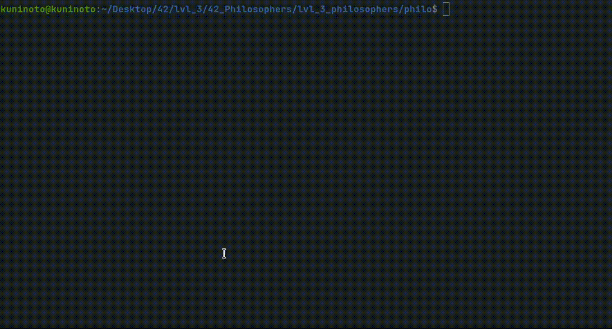

# Philosophers (42Porto - 42Cursus) &nbsp; &nbsp;  

## Grade: 100/100

### Installing and running the project:

1- Clone this repository
	
	git clone https://github.com/Kuninoto/42_Philosophers
3- Navigate to _lvl_3_philosophers_ and run `make`
	
	cd 42_Philosophers/lvl_3_philosophers
   	make
4- `make clean` so that you don't keep those object files that you won't need anymore

	make clean
5- Run your new dining philosopher simulation program!

	./philo nbr_of_philos time_to_die time_to_eat time_to_sleep [nbr_of_times_each_philo_must_eat]

###  Subject: [Philosophers en_subject](./extras/en.subject_philosophers.pdf)

Mandatory: Solving the dining philosophers problem using **threads** and **mutexes**  
Bonus: Solving the same problem but this time with **processes** and **semaphores**  

#### Side note/warning for 42 students visiting:
I didn't submitted bonus but left its folder here. All works correctly but has leaks on the threads.  
Threads must return their routine function in order to free their resources and because on bonus  
we must use processes I use exit() on the supervisor thread to exit the philosopher (that died) process, causing leaks.
Anyways, it's the always saying: Do not copy or use code you don't understand.

#### Makefile Available Targets:  
`make` or `make all` - compiles philo or philo_bonus (depending on the folder you're in)   
`make clean` - wipes all object files   
`make fclean` - deletes executable and all object files   
`make re` - fclean  + all  

### Useful links:  
General thread understanding:  
https://www.youtube.com/watch?v=ldJ8WGZVXZk  
https://www.youtube.com/watch?v=uA8X5zNOGw8&list=PL9IEJIKnBJjFZxuqyJ9JqVYmuFZHr7CFM  
https://www.youtube.com/watch?v=d9s_d28yJq0&list=PLfqABt5AS4FmuQf70psXrsMLEDQXNkLq2  
https://www.geeksforgeeks.org/multithreading-c-2/  
https://www.youtube.com/watch?v=FY9livorrJI  
https://www.youtube.com/watch?v=xoXzp4B8aQk  

Threads vs. Processes:  
https://www.geeksforgeeks.org/difference-between-process-and-thread/  
https://www.youtube.com/watch?v=IKG1P4rgm54  

Mutex:  
https://www.youtube.com/watch?v=oq29KUy29iQ  
https://www.geeksforgeeks.org/mutex-lock-for-linux-thread-synchronization/  

Project Guide:  
https://github.com/TommyJD93/Philosophers  

General semaphore understanding:  
https://www.geeksforgeeks.org/semaphores-in-process-synchronization/  
https://www.geeksforgeeks.org/use-posix-semaphores-c/  
https://www.youtube.com/watch?v=YSn8_XdGH7c  
https://www.youtube.com/watch?v=XDIOC2EY5JE  
https://www.youtube.com/watch?v=ukM_zzrIeXs  
https://www.tutorialspoint.com/inter_process_communication/inter_process_communication_semaphores.htm  
https://www.timesmojo.com/can-semaphore-be-initialized-to-negative/  
https://stackoverflow.com/questions/15164484/when-to-call-sem-unlink  

Mutex vs. Semaphores:  
https://www.geeksforgeeks.org/mutex-vs-semaphore/  
https://www.youtube.com/watch?v=8wcuLCvMmF8  

Mutex vs. Semaphores Rule of Thumb:
<table>
 <tr>
   <th>Mutex</th>
   <th>Semaphores</th>
 </tr>
 <tr>
   <td>Behaves like a lock</td>
   <td>Behaves like a limited inventory</td>
 </tr>
 <tr>
   <td>pthread_mutex_lock()</td>
   <td>sem_wait(), decrements the number of available things, if sem == 0, waits.</td>
 </tr>
 <tr>
  <td>pthread_mutex_unlock()</td>
  <td>sem_post(), increments back the number of available things</td>
 </tr>
</table>

fork() documentation:  
https://www.ibm.com/docs/en/zos/2.1.0?topic=functions-fork-create-new-process#rtfor  

waitpid() documentation:  
https://www.ibm.com/docs/en/zos/2.1.0?topic=functions-waitpid-wait-specific-child-process-end

sem_open() documentation:
https://www.ibm.com/docs/en/i/7.1?topic=ssw_ibm_i_71/apis/ipcsemo.html  

Inter Process Communication
https://www.tutorialspoint.com/inter_process_communication/inter_process_communication_shared_memory.htm  

## Disclaimer
> At [42School](https://en.wikipedia.org/wiki/42_(school)), almost every project must be written in accordance to the [Norm](./extras/en_norm.pdf), the schools' coding standard. As a result, the implementation of certain parts may appear strange and for sure had room for improvement.

---
Made by Nuno Carvalho (Kuninoto) | nnuno-ca@student.42porto.com  

 <a href="https://www.linkedin.com/in/nuno-carvalho-218822247"/> &nbsp;
